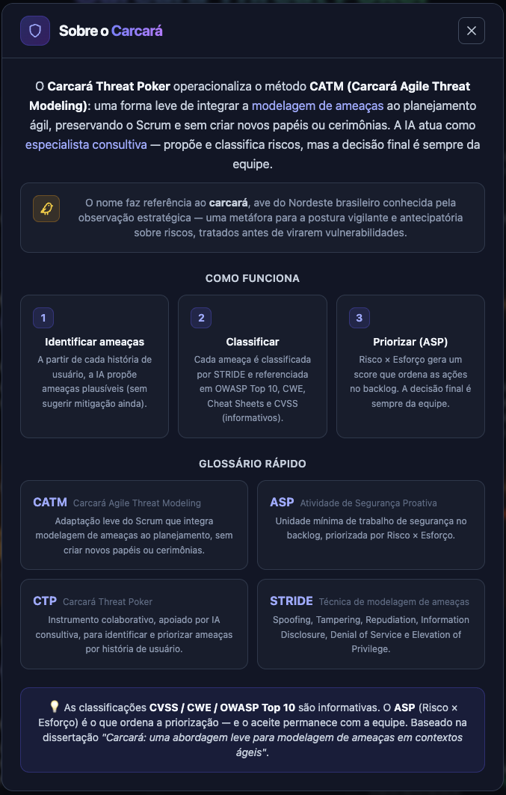
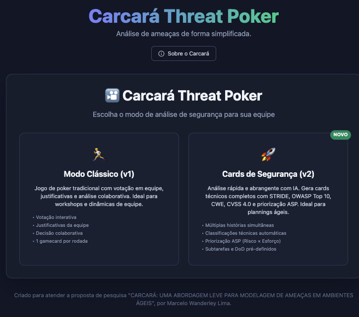

# 🎴 Guia de Uso do Carcará Threat Poker

Este guia explica **a teoria por trás do Carcará** e, em seguida, **como usá-lo** na prática (versões v1 e v2).

---

## 📚 Fundamentação: o que é (e o que não é)

> ⚠️ **Importante:** o Carcará **não é uma modelagem de ameaças tradicional.** É um **modelo leve**, pensado para caber no fluxo ágil sem fricção.

Na modelagem de ameaças **tradicional**, a análise costuma ser conduzida sobre a **arquitetura** do sistema (ex.: Diagramas de Fluxo de Dados), com a aplicação formal de técnicas como o **STRIDE**, normalmente em **fases iniciais de design** e por **especialistas em segurança**. Embora reconhecida, essa abordagem gera **fricção operacional** e exige **conhecimento especializado** — o que dificulta sua adoção no dia a dia de equipes ágeis pequenas e médias.

O **Carcará Agile Threat Modeling (CATM)** é a proposta da monografia *"Carcará: uma abordagem leve para modelagem de ameaças em ambientes ágeis"*. Ele **não substitui** as taxonomias consolidadas (STRIDE, OWASP Top 10, CWE, CVSS) — ele as **operacionaliza de forma leve**, no **nível das histórias de usuário** e durante o **Sprint Planning**, **sem criar novos papéis, cerimônias ou estruturas paralelas de governança**. É uma aplicação prática do princípio de **shift-left security** (antecipar a segurança no início do ciclo).

> 🦅 O nome faz referência ao **carcará**, ave do Nordeste conhecida pela observação estratégica — uma metáfora para a postura vigilante e antecipatória sobre riscos, tratados antes de virarem vulnerabilidades.

### Os dois pilares do método

- **ASP — Atividade de Segurança Proativa:** a **unidade mínima** de ação de segurança, explícita e rastreável, derivada de uma ameaça e integrada ao backlog (como subtarefa, ajuste de critério de aceitação ou tarefa técnica). Cada ASP recebe um **valor de priorização** calculado por **Risco × Esforço de Mitigação** (`ASP = R × EM`). A multiplicação favorece ameaças que combinam **alto impacto** com **boa viabilidade de mitigação**, tornando a priorização objetiva no Sprint Planning.
- **CTP — Carcará Threat Poker:** o **instrumento colaborativo** (inspirado no Planning Poker) que estrutura o raciocínio sobre riscos a partir da descrição da história de usuário. Conta com **IA consultiva** para sugerir e classificar ameaças.

> 🤖 A IA é **consultiva, não prescritiva**: ela amplia o repertório da equipe e reduz a carga cognitiva da análise — mas **a decisão final de priorização e aceite é sempre da equipe**.

### Tradicional × CATM (Carcará)

| Aspecto | Modelagem tradicional | CATM (Carcará) |
|---|---|---|
| Momento | Fases formais de design | Sprint Planning, de forma contínua |
| Unidade de análise | Arquitetura, DFDs, artefatos técnicos | Histórias de usuário |
| Quem conduz | Especialistas / papéis dedicados | A própria equipe ágil, com IA consultiva |
| Estrutura | Cerimônias e governança paralelas | Sem novos papéis ou cerimônias |
| Saída | Relatórios e modelos | ASPs no backlog (subtarefas, DoD, critérios) |
| Taxonomias | STRIDE etc. aplicadas formalmente | STRIDE/Top 10/CWE/CVSS usadas de forma leve (não substituídas) |

Na aplicação, esse contexto também está disponível pelo botão **"Sobre o Carcará"**.

---

# 🚀 Como usar

## Tela inicial — escolha do modo

Ao abrir a aplicação, você escolhe entre os dois modos de operação. Use o botão **"Sobre o Carcará"** para um resumo da proposta a qualquer momento.

Escolha o guia conforme o seu objetivo:

| Modo | Quando usar | Guia |
|------|-------------|------|
| **🏃 Clássico (v1)** | Workshops e dinâmicas de equipe, com votação e debate. 1 gamecard por rodada. | **[Guia v1 →](./GUIA_V1.md)** |
| **🚀 Cards de Segurança (v2)** | Plannings ágeis: análise rápida de várias histórias, com classificações técnicas e priorização automática por ASP. | **[Guia v2 →](./GUIA_V2.md)** |

---

> 🤖 Em ambos os modos, a IA atua como **especialista consultiva** — propõe e classifica riscos, mas a decisão final de priorização e aceite é sempre da equipe.
