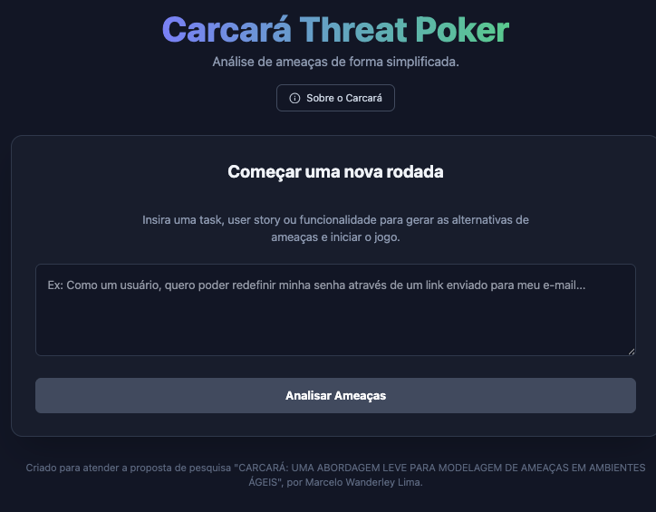
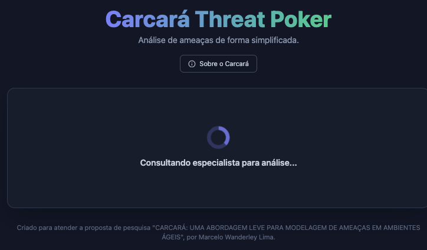

# 🏃 Guia v1 — Modo Clássico (Poker Interativo)

> Novo por aqui? Comece pela [fundamentação e escolha do modo](./GUIA_DE_USO.md).

Modo colaborativo em etapas, ideal para **workshops e dinâmicas de equipe**, estimulando o debate sobre segurança. Gera **1 gamecard por rodada**.

## 1. Configuração
Escolha o modo de jogo — **Solo** (análise individual) ou **em Grupo** — e quantos jogadores participam.

## 2. Descrição da história de usuário
Informe a *user story* (ou tarefa/funcionalidade) que será analisada.

## 3. Geração das opções
A IA, atuando como **Mestre de Jogo** (especialista em modelagem de ameaças com STRIDE), gera **4 opções de ameaça** plausíveis — algumas relevantes e outras menos prioritárias, para estimular a discussão.

## 4. Escolha da melhor opção e justificativa
Cada jogador vota na ameaça que considera mais crítica e escreve uma breve **justificativa** — isso força a reflexão e serve de contexto para a análise.

## 5. Análise da opção selecionada (IA)
Com os votos e justificativas, a IA analisa as opções indicando **Risco**, **Esforço de mitigação**, uma **análise técnica** e a **classificação STRIDE** correspondente.

## 6. Decisão da equipe
A equipe discute e escolhe a **melhor opção de mitigação** a ser priorizada.

## 7. Card para o backlog
A aplicação gera um **Gamecard** estruturado (tarefa, ameaça escolhida, análise, classificação STRIDE e ação sugerida), pronto para copiar e colar em ferramentas como Jira, Trello ou Azure DevOps.

---

> 🤖 Lembrete: a IA atua como **especialista consultiva** — a decisão final de priorização e aceite é sempre da equipe.
>
> ➡️ Veja também o [Guia v2 — Cards de Segurança](./GUIA_V2.md).
