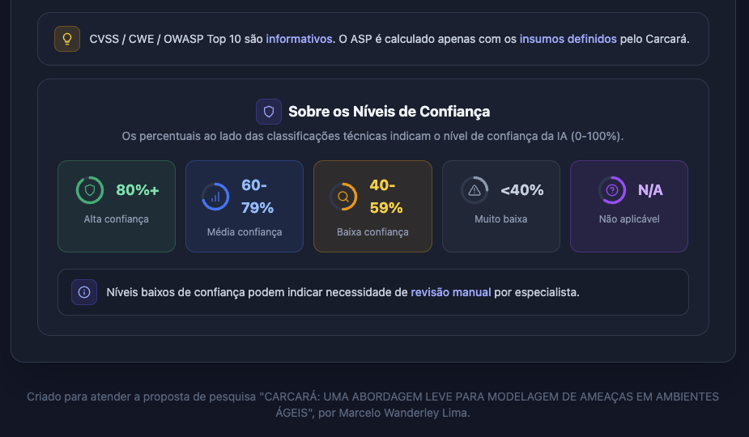

# 🚀 Guia v2 — Cards de Segurança (Análise Direta)

> Novo por aqui? Comece pela [fundamentação e escolha do modo](./GUIA_DE_USO.md).

Abordagem ágil para *plannings*: analisa **várias histórias de uma vez** e entrega **cards técnicos priorizados** por ASP. Há um modo rápido (direto) e um modo colaborativo opcional (com votação).

## 1. Definição das histórias e contexto
Adicione e selecione 1–N histórias candidatas e, se quiser, informe **contexto técnico** adicional. Um checkbox permite **incluir votação** (modo colaborativo) ou seguir direto (modo rápido).

## 2. Análise da IA
A IA processa as histórias e gera os Cards de Segurança, classificando e priorizando as ameaças.

## 3. Seleção dos cards e modos de visualização
Os cards aparecem **ordenados por prioridade ASP** (maior primeiro). No topo há três visualizações — **Lista** (recolhível), **Grade** (2 colunas) e **Acordeão** (um card por vez) — e a seleção por checkbox (ou "Selecionar Todos") para o backlog.

## 4. Priorização ASP e classificações técnicas
Cada card destaca a **Priorização ASP** (score 0–100 com escala verde → vermelho e o cálculo Risco × Esforço) e as classificações **STRIDE**, **OWASP Top 10**, **CWE** e **CVSS 4.0** (informativas, com nível de confiança da IA em anel).

## 5. Subtarefas, DoD de segurança e Cheat Sheets
No painel expansível do card estão as **subtarefas sugeridas**, o **Definition of Done de segurança** e os **OWASP Cheat Sheets** relacionados.

## 6. Níveis de confiança da IA
A legenda explica os **níveis de confiança da IA** (0–100%) exibidos nas classificações técnicas — útil para identificar quando vale uma **revisão manual** por especialista.

## 7. Exportação do card
Selecione os cards desejados e use **Enviar para Backlog** (ou **Copiar card**) para exportar um texto pronto para colar no seu gerenciador de tarefas.

---

> 🤖 Lembrete: as classificações CVSS/CWE/OWASP Top 10 são **informativas**; o **ASP** ordena a priorização e o aceite é da equipe.
>
> ➡️ Veja também o [Guia v1 — Modo Clássico](./GUIA_V1.md).
