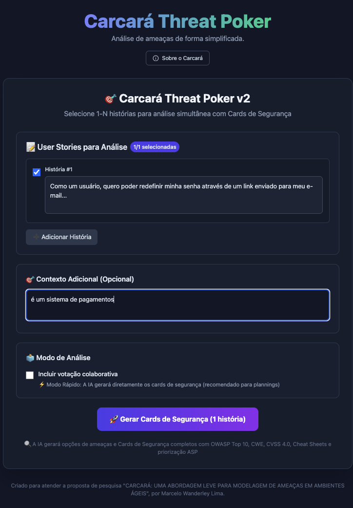
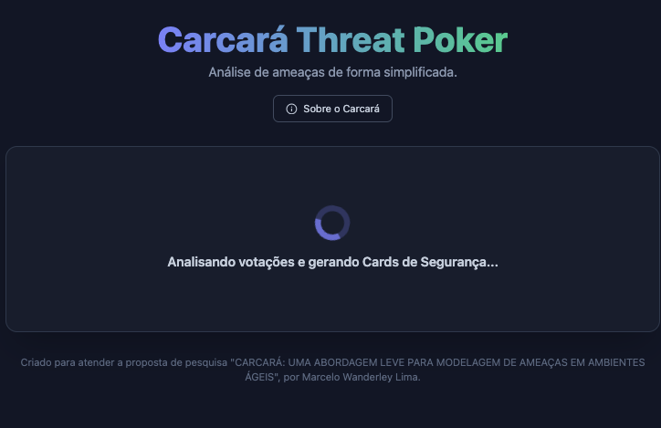
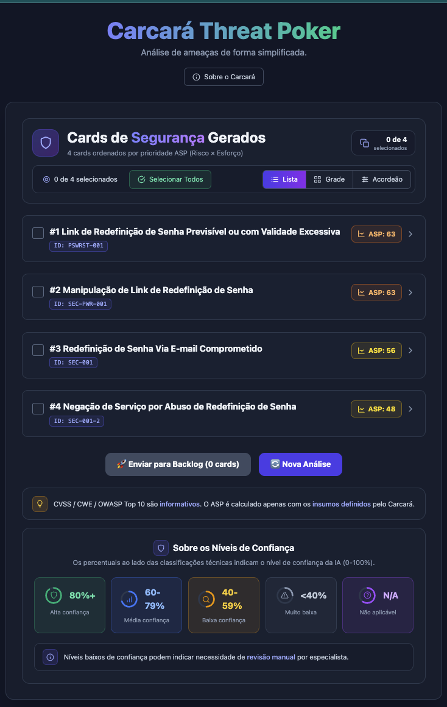
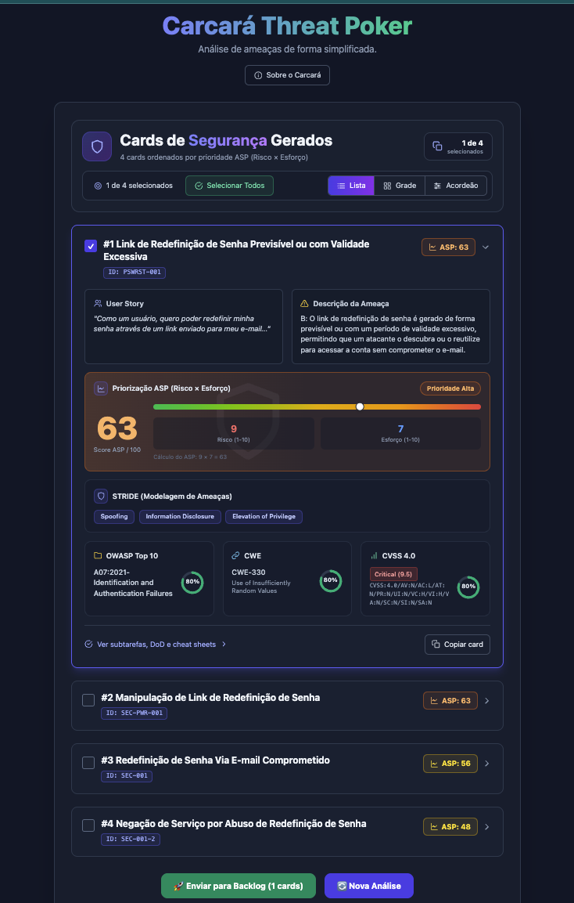
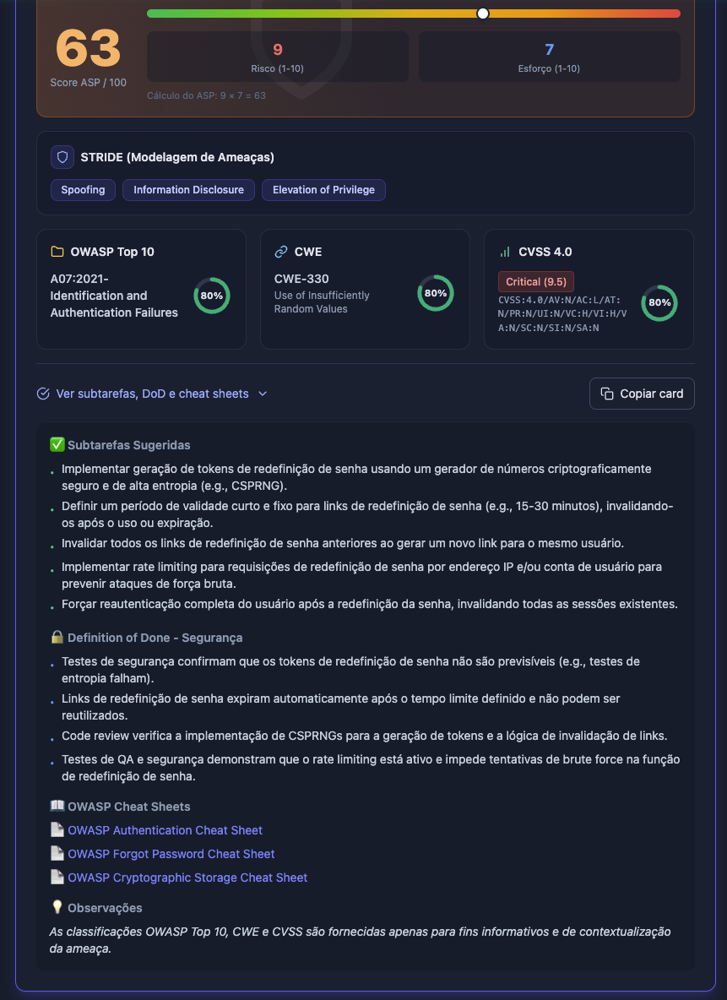
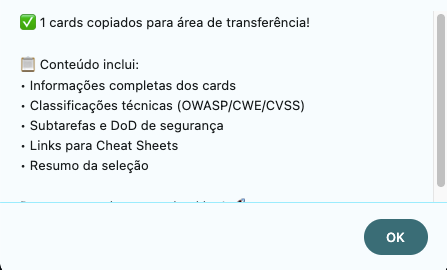

# 🚀 Guia v2 — Cards de Segurança (Análise Direta)

> Novo por aqui? Comece pela [fundamentação e escolha do modo](./GUIA_DE_USO.md).

Abordagem ágil para *plannings*: analisa **várias histórias de uma vez** e entrega **cards técnicos priorizados** por ASP, com **votação opcional**.

## 1. Seleção de histórias
O PO (ou a equipe) adiciona e seleciona 1–N histórias candidatas. Um checkbox permite **incluir votação** (modo colaborativo) ou seguir direto (modo rápido).

## 2. Contexto e geração de opções
É possível informar contexto técnico adicional. No modo colaborativo, a IA propõe ameaças por história para a votação.

## 3. Votação rápida (opcional)
No modo colaborativo, a equipe vota e justifica em 1–2 frases, dando mais contexto para a IA gerar cards mais precisos.

## 4. Cards de Segurança gerados
A IA gera os **Cards de Segurança**, já ordenados pela prioridade **ASP** (maior primeiro). Há três visualizações no topo: **Lista** (recolhível), **Grade** (2 colunas) e **Acordeão** (um card por vez).

## 5. Detalhe do card
Cada card traz a **classificação STRIDE**, **OWASP Top 10**, **CWE** e **CVSS 4.0** (informativos, com nível de confiança da IA em anel), além de **subtarefas**, **DoD de segurança** e **OWASP Cheat Sheets** no painel expansível.

## 6. Priorização ASP
O bloco de **Priorização ASP** destaca o score (0–100) com escala de cor (verde → vermelho), faixa de prioridade e o cálculo explícito **Risco × Esforço**.

## 7. Exportar para o backlog
Selecione os cards desejados (checkbox ou "Selecionar Todos") e use **Enviar para Backlog** para exportar um texto pronto para colar no seu gerenciador de tarefas.

---

> 🤖 Lembrete: as classificações CVSS/CWE/OWASP Top 10 são **informativas**; o **ASP** ordena a priorização e o aceite é da equipe.
>
> ➡️ Veja também o [Guia v1 — Modo Clássico](./GUIA_V1.md).
